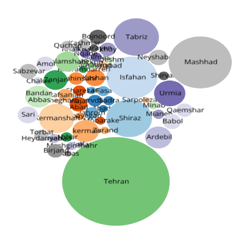
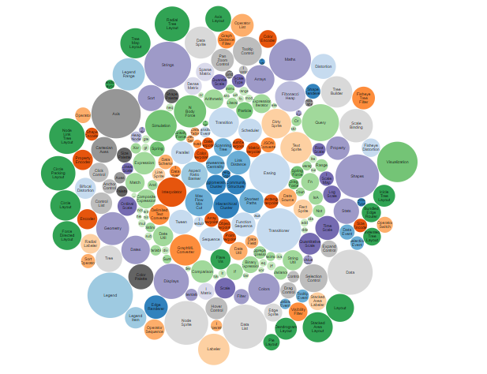
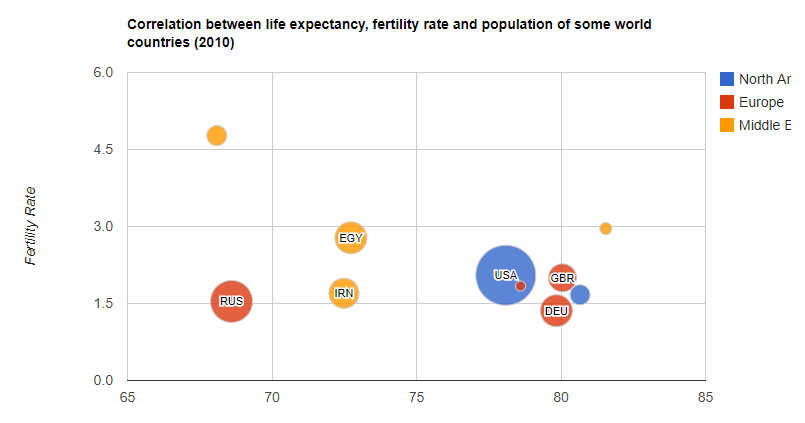

# Bubble Chart 

**Bubble Chart**| **May 10, 2018** | **Iran's Cities Population** | **Contributors:** 
[Majid Farahani](https://farahanimajid.github.io/barchart/)




Bubble charts encode data in the area of circles. Although less perceptually-accurate 
than bar charts, they can pack hundreds of values into a small space. Data shows the 
population of some renown cities in Iran base of the provinces that they place in with 
class hierarchy.

 ###Set up the workspace
 The basic folder structure to generate a bubble plot should be as follows:
   ```powershell
   Bubblechart
       │index.html
       │bubblechart.svg
       │readme.md
       ├─css
       │      style.css
       ├─js
       ├─img
       │      bubble.jpeg
       │      bubble.svg
       │      bubble.PNG
       │      bostock.PNG
       │      googlecharts.PNG
       ├─assets
            └─Iran.csv
            
          
   ```

 

###  Data sources:

[Population of Cities in Iran (2018)](http://worldpopulationreview.com/countries/iran-population/cities/)

### A function-by-function Tutorial

##### HTML
The html document should first call the relevant libraries, and title the document.
``` html
<!DOCTYPE html>
<title>Population of Cities in Iran </title>
<link rel="stylesheet" href="css/style.css">
<svg width="400" height="400" font-family="Open Sans" font-size="10" text-anchor="middle"></svg>
<script src="https://d3js.org/d3.v4.min.js"></script>
```

Then, the svg tag is added to the body. Here we define the size and margin of our chart.
``` html

    var svg = d3.select("svg"),
        margin = {top: 30, right: 20, bottom: 30, left: 20},
        width = +svg.attr("width") - margin.left - margin.right,
        height = +svg.attr("height") - margin.top - margin.bottom;
```


Next, we define the color and also insert the data as a format of csv.
``` html

    var format = d3.format(",d");

    var color = d3.scaleOrdinal(d3.schemeCategory20c);

    var pack = d3.pack()
        .size([width, height])
        .padding(1.5);

    d3.csv("assets/Iran.csv", function(d) {
        d.value = +d.value;
        if (d.value) return d;
    }, function(error, classes) {
        if (error) throw error;
```
Finally, we define the children classes and also define the node and circles. 
then change the size of circles by the number of population of each cities 

``` html
        var root = d3.hierarchy({children: classes})
            .sum(function(d) { return d.value; })
            .each(function(d) {
                if (id = d.data.id) {
                    var id, i = id.lastIndexOf(".");
                    d.id = id;
                    d.package = id.slice(0, i);
                    d.class = id.slice(i + 1);
                }
            });

        var node = svg.selectAll(".node")
            .data(pack(root).leaves())
            .enter().append("g")
            .attr("class", "node")
            .attr("transform", function(d) { return "translate(" + d.x + "," + d.y + ")"; });

        node.append("circle")
            .attr("id", function(d) { return d.id; })
            .attr("r", function(d) { return d.r; })
            .style("fill", function(d) { return color(d.package); });

        node.append("clipPath")
            .attr("id", function(d) { return "clip-" + d.id; })
            .append("use")
            .attr("xlink:href", function(d) { return "#" + d.id; });

        node.append("text")
            .attr("clip-path", function(d) { return "url(#clip-" + d.id + ")"; })
            .selectAll("tspan")
            .data(function(d) { return d.class.split(/(?=[A-Z][^A-Z])/g); })
            .enter().append("tspan")
            .attr("x", 0)
            .attr("y", function(d, i, nodes) { return 13 + (i - nodes.length / 2 - 0.5) * 10; })
            .text(function(d) { return d; });

        node.append("title")
            .text(function(d) { return d.id + "\n" + format(d.value); });
    });
```
<hr>

### CSS
A stylesheet is added to style the text and lines on the plot.

``` html
body {
    font: 10px "Open Sans";
}

.axis path,
.axis line {
    fill: none;
    stroke: #000;
    shape-rendering: crispEdges;
}
```


####  More examples of similiar geovisualizations:
 [Bar chart by Mike Bostock](https://bl.ocks.org/mbostock/4063269)
 
 
 
 [Google Charts](https://developers.google.com/chart/interactive/docs/gallery/bubblechart)
 
 
 
 
 
## Acknowledgement
- [Mike Bostocks](https://d3js.org/) 


## References
- [D3.js](https://d3js.org/) 